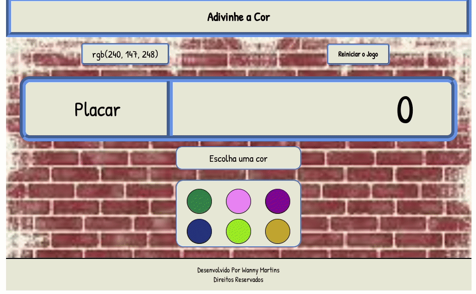

<h1 align="center">Bem Vindo ao Color Guess 👋</h1>

>  Esta aplicação é um jogo criado para consolidar conhecimentos adquiridos durante o módulo de **Fundamentos em desenvolvimento web na Trybe**.

## Regras do Jogo

O usuário deve escolher uma das cores disponívei na paleta para tentar acertar a cor indicada pelo RGB.
- Caso erre perde 1 ponto no placar e não atualiza as cores, nem o RGB inicial, a mensagem "Escolha uma cor" é tocada por "Errou! Tente novamente!";
- Caso acerte acrescenta 3 pontos, a mensagem "Acertou!" aparece e é gerado outro RGB e outra paleta de cores;
- O jogo acaba quando atingir -6 pontos, a mensagem "Você Perdeu! Clique em Reiniciar o jogo!" aparece e o usuário poderá reiniciar começando uma nova contagem nos pontos.

## Ferramentas utilizadas

- HTML,
- CSS,
- JavaScript

## Como usar

Basta acessar clicando na _Homepage_

### 🏠 [Homepage](https://wannymartins.github.io/Project---Color-Guess/)

## Autor

👤 **Wanny Martins**

* Github: [@WannyMartins](https://github.com/WannyMartins)
* LinkedIn: [@wannymartins](https://linkedin.com/in//wannymartins\/)

